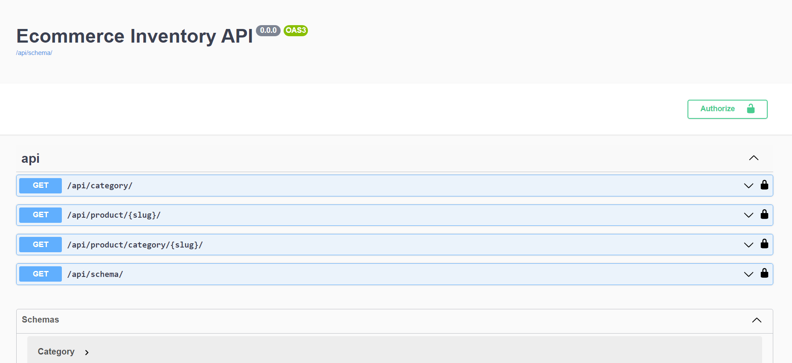

# eCommerce Inventory API

This eCommerce Inventory API application, built on a RESTful API architecture with Django Rest Framework (DRF), offers a robust solution for managing inventory in an e-commerce setting. With its comprehensive features and seamless integration capabilities, the application provides a reliable and efficient way to handle inventory operations.

Leveraging the power of DRF, this application ensures easy implementation of RESTful endpoints, enabling seamless communication between the client and server. The Django framework provides a solid foundation for secure and scalable inventory management.

Using this API, businesses can effortlessly perform essential inventory functions such as adding products, updating quantities, and retrieving stock information. The API supports authentication and authorization mechanisms to ensure secure access to sensitive inventory data.

Through the use of DRF serializers, data validation and transformation are handled efficiently, ensuring consistent and accurate inventory management. Additionally, this application offers error handling and comprehensive documentation, making it easier for developers to integrate and work with the API.

With this eCommerce Inventory API application, businesses can streamline their inventory management processes, enhance operational efficiency, and deliver exceptional customer experiences.

  

## Technologies

- Python
- Django
- Django Rest Framework
- Swagger
- PostgreSQL

## Setup

- Clone the project: `git@github.com:rOluochKe/ecommerce-inventory-api.git`
- Change directory into : `cd /eCommerceInventory`
- Create your environment and install dependencies: `pip install -r requirements.txt`
- Run migrations: `python manage.py makemigrations && python manage.py makemigrations product`
- Create super user: `python manage.py createsuperuser`
- Navigation to admin dashboard: `http://localhost:8000/admin` login and create products
- Run tests: `pytest` and test coverage: `pytest --cov`
- View api documentation: `http://localhost:8000/api/schema/docs/#/api`
